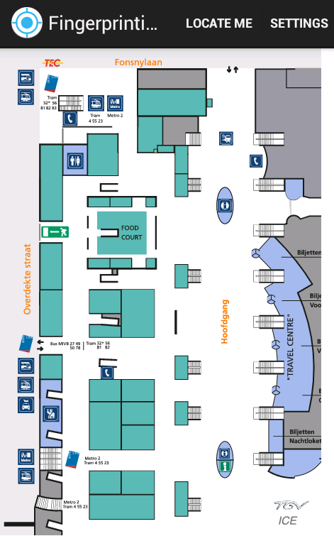
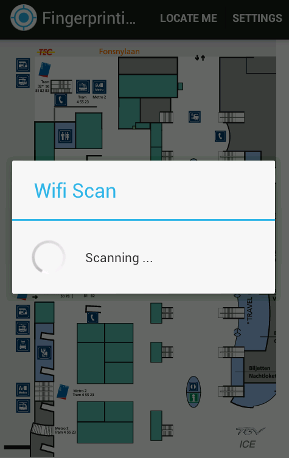
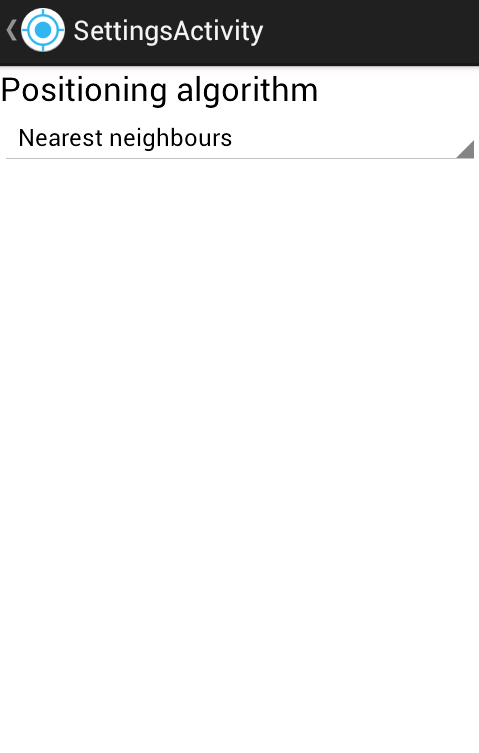

FIPS-Android-Online
====================

Project Overview
----------------

This repository is part of the project "An Extensible Framework for Indoor Positioning on Mobile Devices", which is the master thesis that I did in 2011-2012 at the Vrije Universiteit Brussel to achieve my "Master in Applied Computer Science". My promotor for this master thesis was [Prof. Dr. Beat Signer](http://www.beatsigner.com/). The thesis document can be found [here](https://www.dropbox.com/s/j0xehv5qodxh3id/Van%20Rossem%20-%202012%20-%20A%20FrameWork%20for%20Indoor%20Positioning%20on%20Mobile%20Devices.pdf).

The entire project is divided into several repositories:

* [FIPS-Datastore](https://github.com/wvrossem/FIPS-Datastore)
* [FIPS-Server](https://github.com/wvrossem/FIPS-Server)
* [FIPS-Tool](https://github.com/wvrossem/FIPS-Tool)
* [FIPS-Android-Offline](https://github.com/wvrossem/FIPS-Android-Offline)
* [FIPS-Android-Online](https://github.com/wvrossem/FIPS-Android-Online)

Android Online Application Usage
---------------------------------

This is an Android application to do positioning with a WLAN indoor positioning system. It provides the posiblity for a user to locate himself at an indoor location. It requires that a [FIPS-Server](https://github.com/wvrossem/FIPS-Server) is running with data in the [FIPS-Datastore](https://github.com/wvrossem/FIPS-Datastore) that was collected with [FIPS-Android-Offline](https://github.com/wvrossem/FIPS-Android-Offline) application. 

In order for users to position themselves, a button is provided to iniate a WiFi scan and send a request to the server. A settings menu is also available to configure what algorithm to run on the server.

##### The main interface of the application

##### WiFi scan in progress

##### The settings menu

License
-------

This program is free software: you can redistribute it and/or modify it under the terms of the GNU General Public License as published by the Free Software Foundation, either version 3 of the License, or (at your option) any later version.

This program is distributed in the hope that it will be useful, but WITHOUT ANY WARRANTY; without even the implied warranty of MERCHANTABILITY or FITNESS FOR A PARTICULAR PURPOSE.  See the GNU General Public License for more details.

